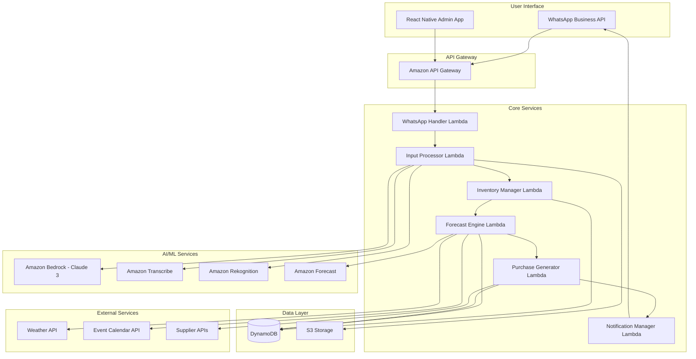

# Design Document: Vyapar.ai Inventory Copilot

## Overview

Vyapar.ai is a serverless, AI-powered inventory management system designed specifically for Indian SMBs and Kirana stores. The system leverages AWS services to provide a scalable, cost-effective solution that handles multimodal input through WhatsApp, performs intelligent demand forecasting, and automates purchase order generation.

The architecture follows a microservices pattern using AWS Lambda functions, with Amazon DynamoDB for data persistence, and integrates multiple AI services including Amazon Bedrock (Claude 3), Amazon Transcribe, and Amazon Forecast for intelligent inventory management.

## Architecture

### High-Level Architecture



### Technology Stack

- **Frontend**: WhatsApp Business API, React Native (Admin Dashboard)
- **Backend**: AWS Lambda (Node.js/Python), Amazon API Gateway
- **AI/ML**: Amazon Bedrock (Claude 3), Amazon Transcribe, Amazon Rekognition, Amazon Forecast
- **Database**: Amazon DynamoDB (NoSQL)
- **Storage**: Amazon S3 (Images, Audio files)
- **Authentication**: Amazon Cognito
- **Monitoring**: Amazon CloudWatch, AWS X-Ray
- **Deployment**: AWS SAM/CDK, GitHub Actions

## Components and Interfaces

### 1. WhatsApp Handler Service

**Purpose**: Manages all WhatsApp Business API interactions and message routing.

**Key Functions**:
- Webhook endpoint for WhatsApp messages
- Message type detection (text, voice, image)
- User authentication and session management
- Response formatting and delivery

**Interfaces**:
```typescript
interface WhatsAppMessage {
  messageId: string;
  userId: string;
  storeId: string;
  messageType: 'text' | 'voice' | 'image';
  content: string | Buffer;
  timestamp: Date;
  language?: string;
}

interface WhatsAppResponse {
  messageId: string;
  content: string;
  messageType: 'text' | 'interactive' | 'template';
  buttons?: Button[];
}
```

### 2. Input Processor Service

**Purpose**: Processes multimodal input (voice, images, text) and extracts inventory-relevant information.

**Key Functions**:
- Voice-to-text transcription using Amazon Transcribe
- Image analysis using Amazon Rekognition
- Natural language processing using Amazon Bedrock
- Inventory update extraction and validation

**Interfaces**:
```typescript
interface ProcessedInput {
  inputId: string;
  storeId: string;
  inputType: 'voice' | 'image' | 'text';
  extractedData: InventoryUpdate[];
  confidence: number;
  language: string;
  processingTime: number;
}

interface InventoryUpdate {
  productId?: string;
  productName: string;
  quantity: number;
  action: 'sold' | 'received' | 'damaged' | 'returned';
  timestamp: Date;
}
```

### 3. Inventory Manager Service

**Purpose**: Core inventory management including stock tracking, product catalog, and inventory operations.

**Key Functions**:
- Real-time inventory updates
- Product catalog management
- Stock level monitoring
- Expiration date tracking
- Inventory reconciliation

**Interfaces**:
```typescript
interface Product {
  productId: string;
  storeId: string;
  name: string;
  category: string;
  brand?: string;
  unit: string;
  currentStock: number;
  reorderPoint: number;
  maxStock: number;
  costPrice: number;
  sellingPrice: number;
  expirationDate?: Date;
  supplierId: string;
}

interface InventoryTransaction {
  transactionId: string;
  storeId: string;
  productId: string;
  type: 'sale' | 'purchase' | 'adjustment' | 'return';
  quantity: number;
  unitPrice?: number;
  timestamp: Date;
  source: 'whatsapp' | 'manual' | 'system';
}
```

### 4. Forecast Engine Service

**Purpose**: Demand forecasting using historical data, local events, and weather patterns.

**Key Functions**:
- Historical sales analysis
- Seasonal pattern detection
- Local event impact modeling
- Weather-based demand adjustment
- Confidence interval calculation

**Interfaces**:
```typescript
interface DemandForecast {
  forecastId: string;
  storeId: string;
  productId: string;
  forecastPeriod: '7d' | '14d' | '30d';
  predictedDemand: number;
  confidenceInterval: {
    lower: number;
    upper: number;
  };
  factors: ForecastFactor[];
  generatedAt: Date;
}

interface ForecastFactor {
  type: 'seasonal' | 'event' | 'weather' | 'trend';
  impact: number;
  description: string;
}
```

### 5. Purchase Generator Service

**Purpose**: Automated purchase order generation and supplier management.

**Key Functions**:
- Reorder point monitoring
- Purchase order optimization
- Supplier selection and communication
- Order tracking and status updates

**Interfaces**:
```typescript
interface PurchaseOrder {
  orderId: string;
  storeId: string;
  supplierId: string;
  items: PurchaseOrderItem[];
  totalAmount: number;
  status: 'draft' | 'sent' | 'confirmed' | 'delivered' | 'cancelled';
  createdAt: Date;
  expectedDelivery?: Date;
}

interface PurchaseOrderItem {
  productId: string;
  quantity: number;
  unitPrice: number;
  totalPrice: number;
}

interface Supplier {
  supplierId: string;
  name: string;
  contactInfo: ContactInfo;
  products: string[];
  leadTime: number;
  minimumOrder?: number;
  paymentTerms: string;
  rating: number;
}
```

### 6. Notification Manager Service

**Purpose**: Manages all system notifications and alerts through WhatsApp and other channels.

**Key Functions**:
- Alert generation and prioritization
- Multi-language message formatting
- Delivery confirmation tracking
- Notification preferences management

**Interfaces**:
```typescript
interface Notification {
  notificationId: string;
  storeId: string;
  type: 'stockout' | 'reorder' | 'expiry' | 'forecast' | 'order_status';
  priority: 'low' | 'medium' | 'high' | 'critical';
  message: string;
  language: string;
  channels: ('whatsapp' | 'email' | 'sms')[];
  scheduledAt?: Date;
  deliveredAt?: Date;
}
```

## Data Models

### Core Entities

#### Store
```typescript
interface Store {
  storeId: string;
  ownerId: string;
  name: string;
  address: Address;
  phoneNumber: string;
  whatsappNumber: string;
  storeType: 'kirana' | 'pharmacy' | 'electronics' | 'general';
  operatingHours: OperatingHours;
  preferredLanguage: string;
  timezone: string;
  createdAt: Date;
  isActive: boolean;
}
```

#### User
```typescript
interface User {
  userId: string;
  storeId: string;
  name: string;
  phoneNumber: string;
  role: 'owner' | 'manager' | 'staff';
  permissions: Permission[];
  preferredLanguage: string;
  isActive: boolean;
  lastActiveAt: Date;
}
```

#### Analytics
```typescript
interface SalesAnalytics {
  analyticsId: string;
  storeId: string;
  period: 'daily' | 'weekly' | 'monthly';
  startDate: Date;
  endDate: Date;
  totalSales: number;
  totalProfit: number;
  topProducts: ProductSales[];
  slowMovingProducts: ProductSales[];
  generatedAt: Date;
}
```

### DynamoDB Table Design

**Primary Tables**:
1. **Stores** - Store information and configuration
2. **Users** - User accounts and permissions
3. **Products** - Product catalog per store
4. **Inventory** - Current stock levels and transactions
5. **Forecasts** - Demand predictions and historical accuracy
6. **PurchaseOrders** - Purchase orders and supplier interactions
7. **Notifications** - System alerts and delivery status
8. **Analytics** - Pre-computed analytics and insights

**Access Patterns**:
- Get store by storeId (PK: storeId)
- Get products by store (PK: storeId, SK: product#productId)
- Get inventory transactions by store and date (PK: storeId, SK: transaction#timestamp)
- Get forecasts by store and product (PK: storeId#productId, SK: forecast#date)

## Error Handling

### Error Categories

1. **Input Processing Errors**
   - Voice transcription failures
   - Image recognition errors
   - Invalid product names or quantities
   - Language detection issues

2. **Business Logic Errors**
   - Insufficient inventory for sales
   - Invalid supplier information
   - Forecast generation failures
   - Purchase order validation errors

3. **External Service Errors**
   - WhatsApp API failures
   - AWS service timeouts
   - Supplier API unavailability
   - Weather/event data service issues

4. **Data Consistency Errors**
   - Concurrent inventory updates
   - Duplicate transaction processing
   - Stale forecast data
   - Synchronization issues

### Error Handling Strategy

```typescript
interface ErrorResponse {
  errorId: string;
  errorType: 'validation' | 'business' | 'system' | 'external';
  errorCode: string;
  message: string;
  userMessage: string;
  language: string;
  retryable: boolean;
  timestamp: Date;
}
```

**Recovery Mechanisms**:
- Exponential backoff for external service calls
- Circuit breaker pattern for unreliable services
- Dead letter queues for failed message processing
- Graceful degradation when AI services are unavailable
- User-friendly error messages in local language

## Testing Strategy

### Dual Testing Approach

The system will employ both unit testing and property-based testing to ensure comprehensive coverage:

**Unit Tests**: Focus on specific examples, edge cases, and integration points
- WhatsApp message parsing edge cases
- Voice transcription accuracy with different accents
- Image recognition with poor lighting conditions
- Supplier API integration failures
- Multi-language text processing

**Property Tests**: Verify universal properties across all inputs using a property-based testing framework
- Minimum 100 iterations per property test
- Each test tagged with: **Feature: vyapar-ai-inventory-copilot, Property {number}: {property_text}**
- Comprehensive input coverage through randomization

**Property-Based Testing Configuration**:
- Framework: fast-check (JavaScript/TypeScript) for Lambda functions
- Test runner: Jest with property-based test integration
- Each correctness property implemented as a single property-based test
- Tests reference design document properties for traceability

Now I need to analyze the acceptance criteria to create correctness properties. Let me use the prework tool to systematically analyze each requirement.
## Correctness Properties

*A property is a characteristic or behavior that should hold true across all valid executions of a system—essentially, a formal statement about what the system should do. Properties serve as the bridge between human-readable specifications and machine-verifiable correctness guarantees.*

### Property 1: Comprehensive Voice Processing
*For any* voice message in Hindi, English, or mixed languages sent via WhatsApp, the system should transcribe it with 95% accuracy and correctly extract product names and quantities from the transcribed text.
**Validates: Requirements 1.1, 1.3, 1.6**

### Property 2: Image-Based Inventory Management
*For any* shelf photo sent via WhatsApp, the system should identify products, estimate quantities, and update inventory levels to reflect the visual stock assessment.
**Validates: Requirements 1.2, 1.4**

### Property 3: Input Error Handling
*For any* invalid or unclear input received through WhatsApp, the system should request clarification and not process incomplete inventory updates.
**Validates: Requirements 1.5**

### Property 4: Comprehensive Notification Delivery
*For any* system event that requires user notification (inventory updates, purchase orders, alerts), the system should deliver notifications via WhatsApp in the user's preferred language.
**Validates: Requirements 1.7, 3.5, 5.6, 9.5**

### Property 5: Intelligent Demand Forecasting
*For any* product with historical sales data, the system should generate demand forecasts for 7, 14, and 30-day periods with confidence intervals, adjusting for local events and weather patterns.
**Validates: Requirements 2.1, 2.2, 2.3, 2.4, 2.7**

### Property 6: New Product Forecasting
*For any* newly added product, the system should generate initial forecasts based on similar product patterns and category data.
**Validates: Requirements 2.5**

### Property 7: Intelligent Purchase Order Generation
*For any* product with inventory below reorder point, the system should automatically generate optimized purchase orders considering lead times, demand forecasts, and storage capacity.
**Validates: Requirements 3.1, 3.2, 3.3**

### Property 8: Purchase Order Communication
*For any* generated purchase order, the system should send it to suppliers via appropriate channels and track order status through delivery.
**Validates: Requirements 3.4, 3.6, 3.7**

### Property 9: Real-Time Inventory Tracking
*For any* inventory transaction (sale, purchase, adjustment), the system should immediately update stock quantities and maintain accurate inventory levels for all products.
**Validates: Requirements 4.1, 4.2, 4.3**

### Property 10: Expiration Management
*For any* perishable product, the system should track expiration dates and send alerts when products approach expiration.
**Validates: Requirements 4.4, 4.5**

### Property 11: Product Organization
*For any* product in the system, it should be properly categorized by type, brand, and supplier with discrepancy detection and flagging.
**Validates: Requirements 4.6, 4.7**

### Property 12: WhatsApp Interface Capabilities
*For any* user interaction through WhatsApp, the system should support text, voice, and image messages with menu-driven options for common actions.
**Validates: Requirements 5.1, 5.3**

### Property 13: Inventory Status Reporting
*For any* inventory status request, the system should provide formatted reports with current stock levels and relevant analytics.
**Validates: Requirements 5.4**

### Property 14: Multi-User Access Control
*For any* store with multiple users, the system should enforce role-based permissions and maintain conversation history for audit purposes.
**Validates: Requirements 5.5, 5.7**

### Property 15: Event-Based Recommendations
*For any* detected local event or seasonal pattern, the system should provide relevant stocking recommendations via WhatsApp.
**Validates: Requirements 6.1, 6.4, 6.5, 6.7**

### Property 16: Supplier Management
*For any* supplier in the system, their information, performance metrics, and product catalogs should be maintained with verification and notification capabilities.
**Validates: Requirements 7.1, 7.2, 7.3, 7.4**

### Property 17: Supplier Redundancy and Alternatives
*For any* product, the system should support multiple suppliers and suggest alternatives when supplier issues arise.
**Validates: Requirements 7.5, 7.6**

### Property 18: Payment Tracking
*For any* supplier transaction, the system should track payments and facilitate settlements.
**Validates: Requirements 7.7**

### Property 19: Comprehensive Analytics
*For any* store, the system should generate daily, weekly, and monthly reports with sales analysis, profit calculations, and performance comparisons.
**Validates: Requirements 8.1, 8.2, 8.3, 8.5**

### Property 20: Opportunity Identification
*For any* store with sufficient data, the system should identify seasonal trends, new product opportunities, and provide insights in simple language with visual charts.
**Validates: Requirements 8.4, 8.6, 8.7**

### Property 21: Multi-Language Support
*For any* user interaction, the system should support Hindi, English, and major regional Indian languages with consistent translation and context preservation during language switches.
**Validates: Requirements 9.1, 9.2, 9.4, 9.6**

### Property 22: Language Selection
*For any* new user onboarding, the system should provide language selection options.
**Validates: Requirements 9.7**

### Property 23: Data Security
*For any* data in the system, it should be encrypted in transit and at rest with secure multi-factor authentication for user access.
**Validates: Requirements 10.1, 10.2**

### Property 24: Security Incident Response
*For any* detected data breach, the system should immediately notify affected users.
**Validates: Requirements 10.4**

### Property 25: Data Portability and Deletion
*For any* user data request, the system should provide export capabilities and permanently delete data within 30 days when requested.
**Validates: Requirements 10.5, 10.7**

## Testing Strategy

### Dual Testing Approach

The Vyapar.ai system will employ both unit testing and property-based testing to ensure comprehensive coverage and reliability:

**Unit Tests**: Focus on specific examples, edge cases, and integration points
- WhatsApp message parsing with various Indian language inputs
- Voice transcription accuracy with different regional accents
- Image recognition with poor lighting and cluttered shelves
- Supplier API integration failures and timeouts
- Currency calculations and GST handling for Indian market
- Festival date calculations and regional variations

**Property Tests**: Verify universal properties across all inputs using fast-check framework
- Minimum 100 iterations per property test for thorough randomization
- Each test tagged with: **Feature: vyapar-ai-inventory-copilot, Property {number}: {property_text}**
- Comprehensive input coverage through randomized test data generation

**Property-Based Testing Configuration**:
- Framework: fast-check (JavaScript/TypeScript) for AWS Lambda functions
- Test runner: Jest with property-based test integration
- Each correctness property implemented as a single property-based test
- Tests reference design document properties for complete traceability
- Focus on invariants, round-trip properties, and error condition handling

**Integration Testing**:
- End-to-end WhatsApp conversation flows
- AWS service integration testing with localstack
- Multi-language conversation scenarios
- Supplier integration workflows
- Performance testing under Indian network conditions

**Testing Balance**:
- Unit tests handle concrete examples and edge cases specific to Indian SMB context
- Property tests verify general correctness across all possible inputs
- Integration tests ensure components work together in realistic scenarios
- Together they provide comprehensive coverage for the complex multimodal AI system

The testing strategy ensures reliability for the critical inventory management needs of Indian Kirana stores while handling the complexity of multimodal AI processing and real-time demand forecasting.